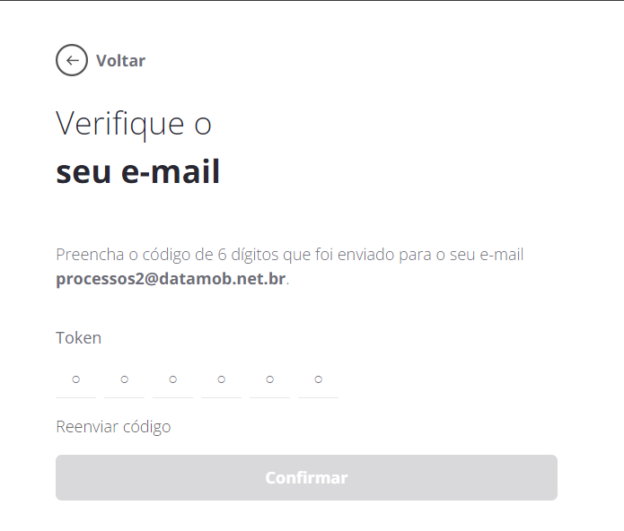

# Primeiro Acesso e Vínculo ao Enterprise

Quando o **TESTE DEV** é ativado para uma empresa, as seguintes tarefas são executadas pelo sistema, para possibilitar o acesso do usuário administrador da empresa ao Portal:

* Criação das credenciais do Portal de Administração;
* Envio de um E-mail de boas-vindas, contendo as credenciais e um link para acessar o Portal de Administração.

Para acessar o Portal de Administração, siga os passos descritos nesta seção:

1. Acesse o endereço <mark style="color:orange;">https://ent-clarobr.datamobpro.com/login</mark> para visualizar a tela de acesso do Portal. De preferência utilize um navegador Google Chrome, com a versão mais atualizada.
2. Preencha os campos de “**E-mail**” e “**Senha**” com as credenciais de acesso, recebidas no E-mail de boas-vindas.
3. Clique em “**Iniciar Seção**” para confirmar as informações e acessar o Portal.

<figure><figcaption></figcaption></figure>

Em seu primeiro acesso, após clicar em "**Iniciar Sessão**”, o usuário deverá confirmar os dados da empresa. A tela de confirmação dos dados da empresa aparecerá somente no primeiro acesso e é mostrada na figura a seguir.

<figure><figcaption></figcaption></figure>

4. Confirmar o Nome da Empresa e E-mail;
5. Criar uma senha; <mark style="color:red;">(Adicionar informações sobre a complexidade da senha)</mark>
6. Repetir a digitação da senha para confirmá-la;
7. Marcar que concorda com a Política de Privacidade e com o Termos de uso;
8. Clicar no botão "Próximo''.

Após o passo 8, uma nova tela de confirmação de E-mail irá aparecer. Uma mensagem com um token de confirmação é enviada para o E-mail da empresa.


**OBSERVAÇÃO**

O E-mail de confirmação é uma mensagem automática e pode ser identificada em seu provedor de E-mail como spam. Por isso, caso não tenha recebido, verifique também na caixa de spam.


9. O token de confirmação deve ser inserido na tela para confirmar o cadastro da empresa. A tela de confirmação é mostrada a seguir:

<figure><figcaption></figcaption></figure>

Caso não tenha recebido o token por e-mail, o usuário pode solicitar que seja enviado novamente clicando na opção “**Reenviar código**" que fica disponível logo acima do botão "**Confirmar**".

<figure><figcaption></figcaption></figure>

Após esta confirmação, o sistema abrirá a tela para "Criar conta de administrador".

Nesta etapa , será solicitada uma conta de domínio próprio da empresa , para realizar o vínculo no Android Enterprise. Ao utilizar um domínio próprio, a empresa poderá ter acesso a funcionalidades avançadas do programa Better Togheter da Google em versões futuras. Para isso é necessário informar uma conta de domínio próprio, que possua o Cloud Identity da Google configurado.&#x20;

**Exemplo:** @empresa.com

<figure><figcaption></figcaption></figure>

Caso o usuário informar seja informada esta conta de e-mail coorporativo contendo o Cloud Identity o sistema seguira o processo normal do fluxo. Caso o usuário  informar uma conta que não tenha o Cloud Identity configurado, será apresentada a seguinte tela:

<figure><figcaption></figcaption></figure>

**Inscreva-se com um e-mail de trabalho**: Nesta opção, é possível realizar nova tentativa de informar um e-mail corporativo (ex: nome@empresa.com) que possua o Cloud Identity da Google configurado.  Então, clique em "Tentar de novo com um e-mail de trabalho para retornar e inserir um endereço de e-mail corporativo válido.

**Comprar domínio da empresa**: Nesta opção, caso a sua empresa ainda não possua um domínio próprio (ex: empresa.com) e um e-mail corporativo correspondente, você pode adquirir um novo domínio. Clique em "Comprar um domínio" para ser direcionado a um serviço de registro de domínios, onde você pode comprar um domínio para sua empresa e, em seguida, utilizar um e-mail associado a esse domínio para a inscrição.

**Inscreva-se apenas para Android**: Agora se você está planejando gerenciar apenas dispositivos Android, pode criar um pacote de contas do Google Play gerenciado, mesmo utilizando um e-mail pessoal. Clique em "Inscreva-se" para prosseguir com a inscrição utilizando um e-mail pessoal, limitando a gestão apenas a dispositivos Android.


**OBSERVAÇÃO:** Importante destacar que o Google não aceita contas GSuite e recomenda-se criar uma conta comum para a empresa (por exemplo, [nomedaempresa@google.com](mailto:nomedaempresa@google.com)).


Após escolher uma das três opções acima, siga os próximos passos para finalizar o processo de vínculo no Android Enterprise.

Na tela Google Play use o botão “**Fazer Login**" para logar na conta ou caso não tenha a conta, poderá criar uma nova conta.&#x20;

<figure><figcaption></figcaption></figure>

Caso precise criara uma conta Google serão solicitadas mais informações na tela "**Detalhes do Contato**".

Leia as informações de orientação do Google Play Gerenciado e preencha os dados da pessoa da empresa que será o contato oficial de proteção de dados e da pessoa que será o representante da União Europeia. Os dois campos podem ser preenchidos com o mesmo contato da empresa. Estas informações podem ser gerenciadas posteriormente no **TESTE DEV** no menu "Empresas", submenu "Informações da Empresa".

A tela de "Detalhes do Contato" é apresentada na sequência.

<figure><figcaption></figcaption></figure>

Após confirmar os dados, será exibida a tela do **TESTE DEV** com a mensagem _**"Parabéns! Sua empresa foi registrada no Android Enterprise com sucesso."**_

<figure><figcaption></figcaption></figure>

Clique em "Ok" e poderá iniciar as configurações necessárias para gerenciar os dispositivos da sua empresa.
