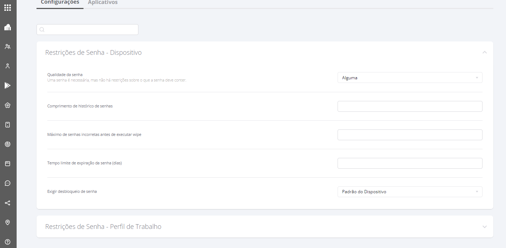

---
layout:
  title:
    visible: true
  description:
    visible: false
  tableOfContents:
    visible: true
  outline:
    visible: true
  pagination:
    visible: true
---

# Configurações Gerais - Android - Work Profile

Work Profile é um modo de gerenciamento exclusivo para dispositivos pessoais, ele permite que um usuário com o seu dispositivo pessoal possa criar um ambiente seguro para utilizar aplicativos de trabalho, garantindo segurança necessária para as informações da empresa e a privacidade do usuário, uma vez que o dispositivo é pessoal.

Para isso, o usuário precisa realizar o download do aplicativo **Android Device Policy** na loja de aplicativos e ler o QR CODE da política com o modo gerenciamento “**Android - Work Profile**”. Ao final do provisionamento, o dispositivo apresentará aplicativos de trabalho com o ícone do perfil de trabalho (maleta azul) e os aplicativos particulares sem ícones.


**IMPORTANTE**

* Não é necessário realizar o Factory reset no dispositivo para realizar o provisionamento, basta realizar o download do aplicativo “ **Android Device Policy**” e seguir os passos de provisionamento.
* Ao realizar o comando “**Remover Dispositivo**” no menu agrupado da tela “**Lista de Dispositivos**”, o perfil de trabalho no dispositivo e os aplicativos de trabalho serão removidos. Não será realizado o reset do dispositivo.
* O usuário possui autonomia para remover o perfil de trabalho através do dispositivo, sem que seja necessário autorização do Administrador.
* O Android Go oferece suporte a cenários de implantação totalmente gerenciados e dedicados. No entanto, o perfil de trabalho (BYOD) é opcional e, portanto, ausente na maioria dos dispositivos Go.


As configurações gerais são agrupadas nos tipos:

* [Restrições de Senha - Dispositivo](configuracoes-gerais-android-work-profile.md#restricoes-de-senha-dispositivo)
* [Restrições de Senha - Perfil de Trabalho](configuracoes-gerais-android-work-profile.md#restricoes-de-senha-perfil-de-trabalho)
* [Trabalho](configuracoes-gerais-android-work-profile.md#trabalho)

<figure><figcaption></figcaption></figure>

### **Restrições de Senha - Dispositivo**

<figure><figcaption></figcaption></figure>

<table data-header-hidden><thead><tr><th width="307.8854625550661"></th><th></th></tr></thead><tbody><tr><td><strong>Configuração</strong></td><td><strong>Descrição</strong></td></tr><tr><td>Qualidade da senha</td><td>
Nesta configuração, temos as seguintes opções disponíveis:

- Não especificado

- Biometria

-Alguma

-Numérica

- Numérica Complexa

- Alfabética

- Alfanumérica

- Complexa

<strong>Observação:</strong> Os campos a seguir serão exibidos conforme a opção de Qualidade de Senha selecionada;
</td></tr><tr><td>Comprimento de histórico de senhas</td><td>Define o número de senhas já usadas que não podem ser reutilizadas</td></tr><tr><td>Máximo de senhas incorretas antes de executar wipe</td><td>Define o máximo de tentativas incorretas antes de executar o Wipe</td></tr><tr><td>Tempo limite de expiração da senha (dias)</td><td>Define quantos dias a senha vai levar para expirar</td></tr><tr><td>Exigir desbloqueio de senha</td><td>Nesta configuração temos as opções: Padrão do dispositivo, ou seja, definida conforme configurado no dispositivo ou todo dia, neste caso a senha será solicitada todo dia</td></tr><tr><td>Comprimento mínimo da senha</td><td>Essa configuração define o tamanho mínimo exigido para as senhas criadas, fortalecendo a segurança dos dados</td></tr><tr><td>Número mínimo de letras exigidas na senha</td><td>Esta configuração define a quantidade mínima de letras necessárias para as senhas, com um número específico de caracteres alfabéticos nas combinações de senha</td></tr><tr><td>Número mínimo de letras minúsculas exigidas na senha</td><td>Essa configuração determina o mínimo de letras minúsculas necessárias em senhas</td></tr><tr><td>Número mínimo de caracteres que não sejam letras (dígitos numéricos ou símbolos) necessários na senha</td><td>Define o mínimo de caracteres não alfabéticos necessários nas senhas</td></tr><tr><td>Número mínimo de dígitos numéricos necessários na senha</td><td>Estipula o número mínimo de dígitos numéricos necessários nas senhas</td></tr><tr><td>Número mínimo de símbolos necessários na senha</td><td>Essa configuração estabelece a quantidade mínima de símbolos exigidos nas senhas, nas combinações de senha</td></tr><tr><td>Número mínimo de letras maiúsculas exigidas na senha</td><td>Estipula a quantidade mínima de letras maiúsculas obrigatórias na senha</td></tr></tbody></table>

### **Restrições de Senha - Perfil de Trabalho**

<figure><figcaption></figcaption></figure>

Se a chave estiver habilitada permite ao usuário manter a mesma senha definida para o “**Dispositivo**” no “**Perfil de Trabalho**”.

Quando a opção estiver desativada, obriga ao usuário criar uma senha diferente da senha pessoal, para acessar o perfil de trabalho. São exibidas as mesmas configurações descritas na tabela acima para definição de senha.

<table data-header-hidden><thead><tr><th width="307.8854625550661"></th><th></th></tr></thead><tbody><tr><td><strong>Configuração</strong></td><td><strong>Descrição</strong></td></tr><tr><td>Qualidade da senha</td><td>
Nesta configuração, temos as seguintes opções disponíveis:

- Biometria

- Alguma

- Numérica

- Numérica Complexa

- Alfabética

- Alfanumérica

- Complexa
</td></tr><tr><td>Comprimento de histórico de senhas</td><td>Define o número de senhas já usadas que não podem ser reutilizadas</td></tr><tr><td>Máximo de senhas incorretas antes de executar wipe</td><td>Define o máximo de tentativas incorretas antes de executar o Wipe</td></tr><tr><td>Tempo limite de expiração da senha (dias)</td><td>Define quantos dias a senha vai levar para expirar</td></tr><tr><td>Exigir desbloqueio de senha</td><td>Nesta configuração temos as opções: Padrão do dispositivo, ou seja, definida conforme configurado no dispositivo ou todo dia, neste caso a senha será solicitada todo dia</td></tr><tr><td>Comprimento mínimo da senha</td><td>Nesta configuração temos as opções: Padrão do dispositivo, ou seja, definida conforme configurado no dispositivo ou todo dia, neste caso a senha será solicitada todo dia</td></tr><tr><td>Número mínimo de letras exigidas na senha</td><td>Esta configuração define a quantidade mínima de letras necessárias para as senhas, com um número específico de caracteres alfabéticos nas combinações de senha</td></tr><tr><td>Número mínimo de letras minúsculas exigidas na senha</td><td>Essa configuração determina o mínimo de letras minúsculas necessárias em senhas</td></tr><tr><td>Número mínimo de caracteres que não sejam letras (dígitos numéricos ou símbolos) necessários na senha</td><td>Define o mínimo de caracteres não alfabéticos necessários nas senhas</td></tr><tr><td>Número mínimo de dígitos numéricos necessários na senha</td><td>Estipula o número mínimo de dígitos numéricos necessários nas senhas</td></tr><tr><td>Número mínimo de símbolos necessários na senha</td><td>Essa configuração estabelece a quantidade mínima de símbolos exigidos nas senhas, nas combinações de senha</td></tr><tr><td>Número mínimo de letras maiúsculas exigidas na senha</td><td>Estipula a quantidade mínima de letras maiúsculas obrigatórias na senha</td></tr></tbody></table>

### Trabalho

Essa funcionalidade permite ao usuário administrador configurar um bloqueio total do dispositivo fora de um período de tempo específico. Assim, permitindo que seja realizado o bloqueio do dispositivo quando o usuário não estiver no horário de trabalho.

Estando na aba "**Configurações**" da tela "**Editar Políticas**", clique em "**Trabalho**" para ver as opções de configuração.

<figure><figcaption></figcaption></figure>

Para realizar o bloqueio de dispositivos fora do horário de trabalho, siga os passos a seguir:

1. Ative a opção "Bloquear dispositivo fora do horário de trabalho".
2. Preencha o campo "Dias de trabalho", com os dias trabalhados na semana dia de início e dia fim.
3. Preencha o campo "Horário de trabalho", com horário de trabalho inicial e final.

<figure><figcaption></figcaption></figure>


**OBSERVAÇÃO**

Ao deixar os campos em branco o sistema considera o período inteiro do dia.

