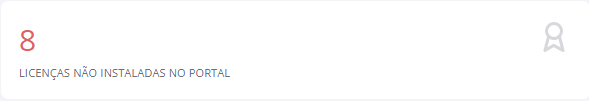
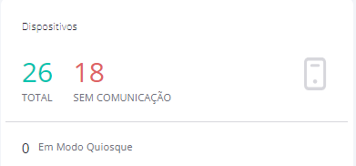
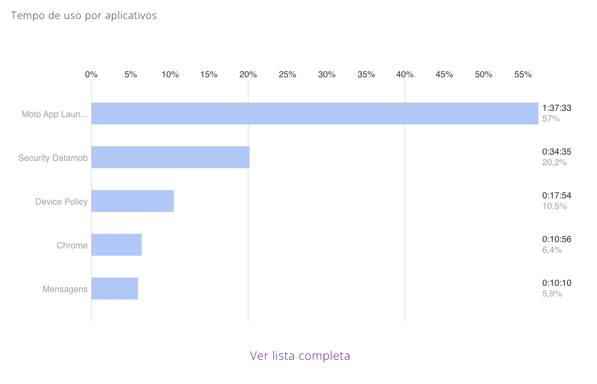

---
layout:
  title:
    visible: true
  description:
    visible: false
  tableOfContents:
    visible: true
  outline:
    visible: true
  pagination:
    visible: true
---

# Dashboard

Esta tela do sistema tem como objetivo possibilitar ao usuário a visualização e análise dos diversos dados de consumos e usos coletados dos dispositivos. Para saber como acessar e analisar os dados exibidos no Dashboard, siga os passos descritos nesta seção.

A tela de Dashboard pode ser considerada a “**Tela Inicial**” do sistema, pois é exibida assim que acessa o Portal, mas também pode ser acessada clicando no menu “**Dashboard**”. Em um primeiro acesso, os indicadores de usuários, dispositivos e consumos não terão ainda informações, por isso estarão zerados.

.png>)

Ao acessar a tela, todas as informações serão exibidas separadas por seções. Cada seção corresponde a um dado diferente, coletado do dispositivo e todas as informações são exibidas de acordo com as opções selecionadas no filtro (Empresa, Grupo ou Usuário).

Ao habilitar a opção do filtro “**Roaming internacional**”, no canto superior direito da tela, o sistema exibirá somente as informações coletadas quando os dispositivos estiverem utilizando uma conexão em Roaming.

.png>)

Os filtros “Empresa”, “Grupo” e “Usuário” permitem realizar uma análise dos dados dos dispositivos de um nível determinado.

Clique no filtro “**Empresa**”, digite e selecione o nome da empresa para exibir as informações coletadas de todos os dispositivos.

.png>)

Clique no filtro “**Grupo**”, digite e selecione o nome do grupo, para exibir as informações coletadas de todos os dispositivos que fazem parte de um Grupo.

.png>)

Clique no filtro “**Usuário**” digite e selecione o usuário, para exibir as informações coletadas do dispositivo do usuário.

.png>)

No canto superior direito da tela, temos alguns ícones que tem as seguintes funcionalidades:

* **Notificações** - No ícone o administrador pode ver as notificações do portal, por exemplo, ao solicitar a geração de um relatório.&#x20;
* **Admin** - No ícone  exibe a opção para que o administrador possa sair do portal e também exibe a versão atual da solução o número da versão.

<figure><figcaption></figcaption></figure>

### **Barra de Status**

A barra de status do Dashboard mostra a situação atual de todos os usuários e licenças da empresa.

.png>)

### **Total de Usuários**

Este indicador exibe o número total de usuários de dispositivos que utilizam o aplicativo **TESTE DEV.**

### **Total de Licenças**

Este indicador exibe o número total de licenças disponíveis no **TESTE DEV**.

### **Licenças não instaladas no portal**

Este indicador exibe o número total de licenças que não possuem dispositivo registrado no portal. Ou seja, são as licenças disponíveis.

Ao clicar nesse indicador, o sistema exibirá a tela de "**Licenças Contratadas**". Para saber como utilizar essa tela, leia a seção [“**Licenças Contratadas**”](dashboard.md#total-de-licencas).

### **Dispositivos**

Este indicador exibe o número total de dispositivos que estão ativos no sistema e os dispositivos sem comunicação. Além disso, possibilita ao administrador ter a visibilidade dos dispositivos que estão em Modo Quiosque.

* **Total -** Esses dispositivos são considerados “**Ativos**” ao instalar e ativar o aplicativo **TESTE DEV.**\
  Ao clicar em "**Total**” o indicador exibirá a tela “**Lista de Dispositivos**” contendo o relatório com as principais informações dos dispositivos ativos.
* **Sem Comunicação -** Este indicador exibe o número total de dispositivos que não estão enviando dados aos servidores a um período prolongado. Ao clicar em "**Sem Comunicação**” o sistema exibe a tela de dispositivos sem comunicação.

<figure><figcaption></figcaption></figure>

Esta falta de comunicação pode ocorrer quando o dispositivo se encontrar nas seguintes situações:

* Desligado;
* Sem conexão de internet;
* Aplicativo desinstalado;

<mark style="color:blue;">O cálculo de tempo para considerar o dispositivo sem comunicação é o tempo de sincronismo configurado na empresa + 10 minutos.</mark>

<mark style="color:blue;">Caso o dispositivo fique sem enviar consumos gerais/informações do dispositivo, por um tempo acima do tempo de sincronismo definido + 10 minutos, ele altera o status para</mark> <mark style="color:blue;"></mark><mark style="color:blue;">**Sem Comunicação.**</mark>

<mark style="color:blue;">Para que o dispositivo volte a comunicar, o administrador pode enviar uma mensagem com o comando</mark> <mark style="color:blue;"></mark><mark style="color:blue;">**START\_SERVICES**</mark> <mark style="color:blue;"></mark><mark style="color:blue;">através do menu</mark> [<mark style="color:blue;">Mensagens</mark> ](mensagens-e-comandos/)<mark style="color:blue;">do portal.</mark>

<mark style="color:blue;">Ao clicar no indicador</mark> <mark style="color:blue;"></mark><mark style="color:blue;">**Sem comunicação ,**</mark><mark style="color:blue;">o sistema exibirá uma tela contendo o relatório com as informações dos dispositivos que estão sem comunicação.</mark>

### **Consumo de Dados no Ciclo**

Este indicador exibe o percentual de consumo de dados móveis dos dispositivos durante o ciclo em relação ao limite total configurado no Perfil de Consumo. Caso não seja configurado um limite no Perfil de Consumo, o gráfico não exibirá o percentual, e o sistema exibirá apenas o valor total de dados em MB utilizados.

### **Consumo de SMS no Ciclo**

Este indicador exibe o percentual de consumo de SMS enviados pelos dispositivos durante o ciclo em relação ao limite total configurado no Perfil de Consumo. Caso não seja configurado um limite no Perfil de Consumo, o gráfico não exibirá o percentual, e exibirá apenas o valor total de SMS utilizados.

### **Consumo de Dados por Aplicativo**

Este gráfico exibe nome e valor da porcentagem dos 5 aplicativos que mais consumiram dados móveis durante o ciclo. Os dados exibidos, são ordenados em percentual.

O valor percentual de cada um dos 5 aplicativos é calculado em relação à soma total de consumo de todos os aplicativos durante o ciclo, os dados são atualizados sempre que acessar a tela.

Ao clicar no botão “Ver lista completa” o sistema exibirá a tela com as informações de todos os aplicativos. Para saber como utilizar essa tela, leia a seção “Aplicativos” deste manual.

<figure><figcaption></figcaption></figure>

### **Consumo de Dados por Usuário**

Este gráfico exibe os 5 usuários que mais consumiram dados móveis durante o ciclo. Os dados exibidos são ordenados em percentual.

O valor percentual de cada um dos 5 usuários é calculado em relação à soma total de consumo de todos os usuários durante o ciclo.

Ao clicar no botão “Ver lista completa” o sistema exibirá a tela com as informações de consumos da empresa. Para saber como utilizar essa tela, leia a seção “Consumo da Empresa” deste manual.

### **Tempo de Uso por Aplicativo**

Este gráfico exibe os 5 aplicativos que mais foram utilizados durante o ciclo. Este tempo é contabilizado apenas quando o aplicativo está em uso, e não precisa estar consumindo dados. Os aplicativos em segundo plano não são contabilizados nesta análise.

O valor percentual de cada um dos 5 aplicativos é calculado em relação à soma total do tempo de uso de todos os aplicativos durante o ciclo.

Ao clicar no botão “Ver lista completa” o sistema exibirá a tela com as informações de todos os aplicativos.

### Inventário de Dispositivos

Este indicador mostra a percentagem dos 5 fabricantes de dispositivos ativos. O valor percentual de cada um dos cinco fabricantes é calculado em relação à soma total de todos os dispositivos ativos.

### Sites mais visitados&#x20;

Este indicador mostra a percentagem dos 5 locais mais visitados nos dispositivos durante o ciclo. O valor percentual de cada um dos 5 sítios é calculado em relação à soma total de todos os acessos aos sítios durante o ciclo.


ATENÇÃO&#x20;

Os sites visitados são obtidos pelo navegador web padrão do sistema **TESTE DEV**. Este navegador é chamado Security Browser e precisa estar instalado e configurado nos dispositivos. Para mais informações sobre administração e configuração do navegador, visite a seção "Security Browser".


### **Indicador de Consumo e Histórico**

Este indicador exibe em percentuais os dados móveis e SMS consumidos nos últimos 6 ciclos.

Para realizar a análise individual dos consumos de dados móveis ou SMS, acesse o item **"Consumos"** no menu "**Empresas**".

### **Indicador de Novos Usuários de Dispositivos e Histórico**

Este indicador exibe a quantidade de usuários de dispositivos ativados nos últimos 6 ciclos e a evolução dos novos usuários do ciclo atual em relação aos do trimestre e do semestre.

Para realizar a análise individual dos usuários de dispositivos, clique em "**Lista de Dispositivos**" no menu "[**Dispositivos**](dashboard.md#dispositivos)".

### **Localização dos Dispositivos**

O mapa exibe a última localização dos dispositivos. Para que a localização seja exibida e atualizada, o dispositivo deve estar conectado à internet, deve haver sinal de GPS e a configuração de "**Modo de Localização**" deve estar "**Ativa**" em Localização na política aplicada ao dispositivo.

<figure><figcaption></figcaption></figure>

<mark style="background-color:orange;">**NOVA IMAGEM**</mark>

<mark style="color:blue;">Caso o sistema não carregar as localizações no mapa, clique no botão "Exibir localizações”,  então elas serão exibidas conforme tela abaixo:</mark>

<figure><figcaption></figcaption></figure>

<mark style="color:blue;">A regra de agrupamento dos dispositivos é a seguinte:</mark>

* <mark style="color:blue;">Azul: maior igual 5</mark>
* <mark style="color:blue;">Amarelo: maior igual 10</mark>
* <mark style="color:blue;">Vermelho: maior igual 100</mark>
* <mark style="color:blue;">Abaixo de 5 mostra os pinos normalmente</mark>

<mark style="color:blue;">O símbolo de gota laranja com um número dentro significa os pontos que o usuário passou em ordem numérica no dia.</mark>

Leia a seção “**Gerenciar Políticas**” deste manual para saber como ativar o "**Modo de Localização**" dos dispositivos.

A localização dos dispositivos é exibida com um marcador no mapa, que pode estar na cor verde ou vermelha, dependendo do status do dispositivo (verde = enviando dados e vermelho = sem envio de dados). Para visualizar as informações da localização, clique no marcador.

Utilize os recursos do mapa para otimizar a visualização das localizações.

### **Manuais para Download**

Nesta tela teremos acesso aos manuais para download. Ao clicar no Saiba mais, será exibida a tela com Documentos e Materiais de Apoio.

### **Alguma Dúvida**

Através da sessão “[**Alguma Dúvida**](dashboard.md#alguma-duvida)?”, teremos acesso a tela onde é possível visualizar as perguntas frequentes realizadas pelos usuários:

Ao clicar em Saiba mais, seremos direcionado a tela a seguir, onde é possível realizar uma pesquisa através do campo de digitação livre ou então filtrar por categoria.

Ao rolar a tela mais para baixo, teremos acesso a lista de perguntas frequentes

E no final da página teremos acesso também aos manuais para Download , assim como temos no Dashboard.

<figure><figcaption></figcaption></figure>
